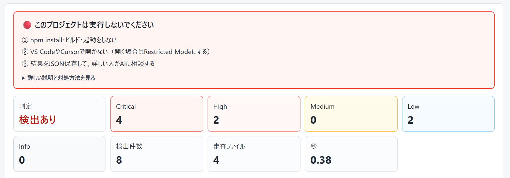
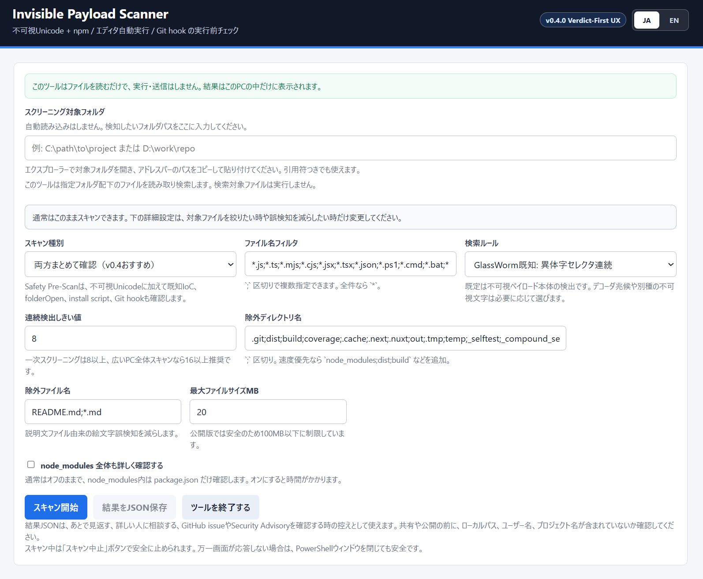

# Invisible Payload Scanner

**A local Windows tool that checks an AI-generated or downloaded project for hidden, dangerous entry points — before you run it.**

It sends nothing to the internet; everything runs on your own PC. No command line needed: download, unzip, and double-click a `.cmd` to check from a browser screen.



Japanese version: [README.md](README.md). See [SECURITY.md](SECURITY.md) (Japanese: [SECURITY.ja.md](SECURITY.ja.md)) for the security policy and reporting scope.

---

## What is it?

- Before you hand a project to an AI agent (Claude / Cursor, etc.) or run `npm install`, **scan the folder once**.
- It answers with a **3-color verdict** — 🔴 **stop** / 🟡 **check first** / 🟢 **no dangerous entry points found**.
- **100% local.** Nothing is uploaded. Files are **only read**, never executed.
- Open source (MIT). You — or your AI — can read exactly what it does.

## Why does it matter?

Some recent attacks are literally invisible:

- commands hidden in source with **invisible special characters** (GlassWorm-style invisible Unicode),
- settings that run **the moment you open or install** (`postinstall`, an editor's `tasks.json`),
- traps slipped into **AI-agent instruction files** (`CLAUDE.md` / `AGENTS.md` / `.cursor/rules`).

Interview tasks, sample code, a repo a friend sent, a project you had an AI generate — some of these run the instant you open them. This tool looks at those entry points **before you run anything**.

---

## How to use it (3 steps)

1. **Download & unzip** the latest `InvisiblePayloadScanner-v0.4.0.zip` from Releases. **Don't `npm install`, build, or run it yet.**
2. **Double-click `Start-InvisiblePayloadScanner.cmd`.** A local Web UI opens in your browser.
   - ⚠ Windows SmartScreen ("Windows protected your PC") may appear. That is expected for running this bundled local script — click **More info → Run anyway**. Limit this only to this tool's bundled `.ps1`; never do the same for `.cmd` / `.ps1` files of unknown origin. (The `.cmd` launcher uses `-ExecutionPolicy Bypass` solely to run the bundled `Start-InvisiblePayloadScanner.ps1`.)
3. **Pick a folder and scan.** Paste the path of the project folder you want to check and press **Scan**. A **verdict card** appears within a few seconds (depending on folder size).
   - The easiest way to enter a path is to open the target folder in File Explorer and copy the address bar. Quoted paths such as `"C:\path\to\project"` are accepted.

> Before scanning, a line is always shown at the top: "This tool only reads files; it does not run or send anything. Results stay on this PC."



---

## Reading the verdict (v0.4.0 Verdict-First)

When the scan finishes, a large **verdict card** appears first — before any table — answering "so, is this folder safe to touch?"

- 🔴 **Do not run this project.** A known attack pattern or a dangerous auto-run setting was found. Next steps:
  1. Do **not** `npm install`, build, or run it.
  2. Do **not** open it in VS Code / Cursor (use Restricted Mode if you must).
  3. Save the result JSON and ask an expert or an AI.
- 🟡 **There's something to check before running.** A suspicious entry point, or possibly a false positive. Check the listed files.
- 🟢 **No dangerous entry points found.** Nothing obvious — but this is **not a complete safety guarantee** (keep using antivirus / EDR).

> Hard terms are reworded inside the card (e.g. "variation selector" → "**invisible special character**", "install lifecycle script" → "**script that runs automatically on install**").

To stop a running scan, press **Stop scan** next to the progress gauge (the server keeps running, so you can change settings and scan again). The **Quit tool** button stops the local server and closes the tool. If the page ever stops responding, closing the launched PowerShell window is also safe.

---

## What's new in v0.4.0 "Verdict-First UX"

- **Verdict-first display** — a 🔴🟡🟢 verdict with next steps, shown before the severity table.
- **Safe scan cancel** — stop mid-scan with the **Stop scan** button (previously you had to close the PowerShell window).
- **Release authenticity (SHA-256)** — verify a downloaded zip is genuine in one line (below).
- **Download-and-execute detection** — flags classic "fetch and run" such as `curl … | bash`, `iwr … | iex`, `powershell -enc …`, and LOLBins (`certutil` / `mshta` / `bitsadmin` / `rundll32`). Low on their own; escalated when combined with `postinstall`, `folderOpen`, etc.

## Verify it's genuine (optional, recommended)

Before extracting, run this one line in PowerShell (adjust the file name to the version you downloaded):

```powershell
Get-FileHash .\InvisiblePayloadScanner-v0.4.0.zip -Algorithm SHA256
```

If the displayed value matches the SHA-256 listed on the GitHub Release page, the file is authentic. If it does not match, do not use it — download it again from the Release page. The startup PowerShell window also prints `Script SHA-256:` so you can compare the script's own hash. Code signing (Authenticode) is a future consideration; SHA-256 comparison is the current verification method.

---

## What it can find (overview)

- **Invisible special characters** — GlassWorm-style invisible Unicode, Trojan Source bidi controls, zero-width characters
- **Scripts that run automatically on install** — npm `prepare` / `postinstall`
- **Editor / AI auto-run** — VS Code / Cursor `tasks.json` (`folderOpen`), AI-agent hooks
- **AI-agent instruction files** — `CLAUDE.md` / `AGENTS.md` / `.cursor/rules`
- **Dangerous "fetch and run"** — `curl|bash`, `iwr|iex`, `powershell -enc`, LOLBins (new in v0.4.0)
- **CI / Git danger commands** — GitHub Actions workflows, `.husky/` / `.githooks/`
- **Known npm supply-chain IoCs** — traces from disclosed attacks (e.g. the May 2026 TanStack incident)

## What it is NOT (honestly)

- **Not an infection detector.** It's a check to help you stop before running something unknown.
- **Not a replacement** for antivirus / EDR / `npm audit` / professional supply-chain audits. Use it alongside resident protection such as ESET or Windows Defender.
- **No detection ≠ confirmed safe.** Binary-embedded malware, code fetched at install time, and obfuscated plain-text loaders are out of scope for this tool alone.

---

> The sections below are detailed reference — read them when you need them.

## Why This Exists

Existing CLI scanners are useful for CI and advanced users. This project focuses on a narrower operational need:

I made this because many existing GlassWorm-related detection tools are CLI-oriented, while I wanted a local Windows UI where I could paste a folder path and quickly run a first-pass check.

- Double-click startup on Windows
- Local-only scanning through a small browser UI
- Progress visibility for large folders
- Human-readable display of invisible code points and surrounding text
- Adjustable rules for future invisible-character indicators

It does not replace a malware scanner, package-audit tool, EDR, or supply-chain security platform. It helps users notice suspicious invisible payloads before running or trusting unfamiliar projects.

## JSON Export

`結果をJSON保存` (Save result as JSON) saves the scan result as a local JSON file. It is useful for later review, asking a more technical person for help, or comparing the finding with GitHub issues, security advisories, or npm package information.

Possible uses:

- Keep a record of the file path, line number, matched term, and severity.
- Share more precise information than a screenshot with a teammate or reviewer.
- Record what was found if you already ran the project and need to investigate.

The JSON may include local paths, user names, and project names. Before posting it to a public issue, advisory, or social media, check whether it contains information you do not want to publish.

It is also reasonable to ask an AI system to help triage the scan log, for example: "Is this a finding I should stop for before running the project, is it likely a false positive, and what should I check next?" If the AI is not a local LLM, review the JSON first and remove local paths, user names, project names, snippets, or any unmasked secrets before sharing it.

## Extra Defense for npm-style Projects

If this scanner reports a finding, or if you are handling an unfamiliar Node.js project, you can also consider package-manager-level safeguards before running install/build commands.

This scanner does not apply these settings automatically. Changing package managers can change project behavior, so review the change with someone technical or ask an AI agent to explain the impact before applying it.

Example for pnpm:

```yaml
# pnpm-workspace.yaml
minimumReleaseAge: 4320
minimumReleaseAgeStrict: true
blockExoticSubdeps: true
```

- `minimumReleaseAge` delays newly published packages before they can be installed. `4320` means three days.
- `minimumReleaseAgeStrict: true` fails dependency resolution if no version satisfies the maturity window.
- `blockExoticSubdeps: true` prevents transitive dependencies from resolving code from git or direct tarball URLs.
- To control install scripts, check `allowBuilds` or `pnpm approve-builds` in pnpm 11.

## Default GlassWorm-Style Pattern

```powershell
([\uFE00-\uFE0F]|\uDB40[\uDD00-\uDDEF]){8,}
```

- `U+FE00` to `U+FE0F` are matched as `\uFE00-\uFE0F`.
- `U+E0100` to `U+E01EF` are matched as the surrogate pair range `\uDB40[\uDD00-\uDDEF]` for .NET/PowerShell regex compatibility.
- `{8,}` means eight or more consecutive matches.
- Use `8` or higher for first-pass screening. Use `16` or higher for broad whole-PC scans.

## Default Exclusions

By default, common generated folders and the scanner's own self-test folder are excluded:

```text
.git;dist;build;coverage;.cache;.next;.nuxt;out;.tmp;temp;_selftest;_compound_selftest;.edge-preview-profile
```

`_selftest` and `_compound_selftest` are intentionally suspicious fixture folders created by the scanner self-test. They are excluded by default so a scan of this scanner's own development folder does not confuse test samples with a normal project finding.

Markdown files are also excluded:

```text
README.md;*.md
```

Markdown documentation often contains emoji-related `U+FE0F` characters, and README files are usually not executed. If a project uses Markdown as a build input or code-generation source, remove this exclusion and scan again.

## Privacy and Safety

- The local server binds to `127.0.0.1`.
- A random local API token is generated on each startup and required for scan and stop requests.
- The Host header is limited to `127.0.0.1:<port>` or `localhost:<port>`.
- API request origins are required and checked to reduce cross-site localhost request abuse.
- Browser safety headers such as Content-Security-Policy are returned.
- Scanned file contents are not uploaded.
- External APIs are not called.
- Files are read, not executed.
- Package manager commands such as `npm install`, `pnpm install`, `yarn install`, and `bun install` are not run.
- Bundled IOC rules are read from local files and are not fetched automatically.
- `.env` / `.npmrc` snippets are hidden, and token-like strings in other snippets are masked before display.
- JSON export is created only when the user clicks the export button.
- Reparse points such as symlinks and junctions are skipped.
- Regex matching uses a timeout per file.
- Request size, custom regex length, file size, and candidate file count are capped.

This design does not protect against a malicious process or browser extension already running under the same Windows user account. It also does not guarantee detection of binary malware, externally downloaded installers, non-Unicode loaders, compromised dependencies, or every malicious execution path.

It also does not attempt full C2 fingerprinting, credential-harvesting behavior detection, complete package-registry trust verification, or every malicious execution path. The focus is local first-pass screening before running unfamiliar projects.

## Supply Chain IOC Scan

Safety Pre-Scan checks for known npm supply-chain IOC strings, install-time scripts, editor/AI-agent auto-run settings, GitHub Actions workflow risk hints, and Git hook candidates in addition to invisible Unicode patterns.

Examples of checked files:

- `package.json`
- `package-lock.json`, `pnpm-lock.yaml`, `yarn.lock`, `bun.lock`
- `.vscode/tasks.json`
- `.cursor/tasks.json`
- `.claude/settings.json`
- `AGENTS.md`, `CLAUDE.md`, `.cursor/rules/*`, `.windsurfrules`, `.github/copilot-instructions.md`
- `.github/workflows/*.yml`
- `.husky/*`, `.githooks/*`
- `.npmrc`, `.env*`
- `node_modules/**/package.json`

Initial rules are bundled in `rules/ioc-rules.json`. They focus on public TanStack npm supply-chain compromise IOCs from May 2026, including malicious git refs, `@tanstack/setup`, `router_init.js`, `tanstack_runner.js`, `filev2.getsession.org`, `seed*.getsession.org`, and known affected version candidates.

v0.3 supplemental rules are separated under `rules/v0.3/` so they are easy to distinguish from the v0.2 base rules.

- `rules/v0.3/contagious-interview-rules.json`: heuristics for fake recruiter repositories, `folderOpen`, download-and-execute stagers, short links, Gist/Drive/Vercel-style staging, install lifecycle scripts, GitHub Actions workflow risk hints, and Git hook candidates
- `rules/v0.3/safe-patterns.json`: local patterns such as `husky install`, `lint-staged`, and `npm run build` that lower low-risk findings without suppressing dangerous indicators

v0.4 supplemental rules live under `rules/v0.4/`.

- `rules/v0.4/download-and-execute-rules.json`: static matches for `curl|wget … | sh/bash/node`, `iwr/irm … | iex`, `powershell -e/-enc <base64>`, and LOLBins (`certutil -urlcache/-decode`, `mshta https:`, `bitsadmin /transfer`, `rundll32 … javascript:`). A single match is Low/Info; it escalates to High/Critical only when combined with folder-open tasks, install lifecycle scripts, Git hooks, or workflows. Official installer one-liners (for example `curl -fsSL https://get.pnpm.io | sh`) are intentionally not added to safe-patterns, so unknown repositories still prompt a check; documentation-context matches are lowered to Info instead.

Safe patterns never override remote download-and-execute, shell, encoded payload, or credential-harvesting indicators.

Package names alone are not treated as proof of compromise. Namespace matches such as `@tanstack/` are prompts for review. Stronger warnings require known affected versions, known IOC strings, auto-run settings, or install-script risk terms.

v0.3 also adds compound findings. For example, if `.vscode/tasks.json` or `.cursor/tasks.json` runs `npm install`, `npm i`, `pnpm i`, `yarn install`, or `bun i` on `folderOpen` and the same project has `prepare` / `postinstall` lifecycle scripts, the scanner reports the combination separately.

v0.3.1 adds context-aware triage fields. The scanner keeps the original danger signal in `signalSeverity`, while `severity`, `actionability`, and `pathContext` describe how urgently the user should respond. In exported JSON, `summary` counts displayed response priority and `signalSummary` counts the original detection signal. Root `.github/workflows/*.yml` files are still treated as repository automation risk. Nested `.github/workflows/*.yml` files inside SDKs, vendored dependencies, or copied upstream components are lowered in action priority because they usually do not run during local project execution. They remain visible as CI review material instead of being suppressed.

## After a Finding

Treat findings in executable or build-time files as higher priority:

- `.js`, `.ts`, `.mjs`, `.cjs`, `.jsx`, `.tsx`
- `.ps1`, `.cmd`, `.bat`, `.sh`
- `package.json`, npm scripts, GitHub Actions, CI configuration
- Configuration files read during build or startup

Findings in README or documentation files are often lower priority and may be false positives, especially when the code points are only a few `U+FE0F` characters near emoji, badges, or accessibility links.

Findings inside editor or AI-tool extension folders, such as `.vscode/extensions/` or `.antigravity/extensions/`, also need separate context. A legitimate extension may include `package.json`, `tasks.json`, build scripts, or development scripts. Treat these as review prompts rather than proof of compromise: check the extension name, publisher, version, and whether you intentionally installed it. If the extension is unfamiliar, recently appeared, or has an unexpected publisher, consider disabling or reinstalling it and checking the official marketplace page.

Recommended triage:

1. Raise the threshold to `16` and scan again.
2. Exclude `README.md;*.md` and scan executable file types.
3. If long invisible runs appear in executed files, stop using the package or repository until reviewed.
4. If you have not run `npm install`, build scripts, or project commands yet, do not run them until the source is checked.
5. Check package origin, recent commits, install scripts, editor tasks, Git hooks, and official advisories.
6. If `.husky/` or `.githooks/` is reported, review it before running git actions such as commit, checkout, merge, or push.
7. If a `Critical` or `High` finding appears after you already ran the project, consider rotating GitHub tokens, npm tokens, API keys, SSH keys, and other credentials that may have been exposed.
8. If you are unsure, ask a technical person or an AI system to review the JSON. For non-local AI services, remove local paths, user names, project names, snippets, and secrets first.

---

## Releases / which one should I use?

Normally, use the latest **v0.4.0 Verdict-First UX**. In the Web UI, keep `両方まとめて確認（v0.4おすすめ）` (check both — recommended) selected, and switch the scan type only when you want invisible-Unicode-only checks.

- **v0.4.0 Verdict-First UX (recommended)** — verdict + next steps, scan cancel, SHA-256 verification, download-and-execute detection.
- **v0.3.1 Context-Aware Triage** — separates the detection signal from response priority. The UI can switch between Japanese and English.
- **v0.3.0 Contagious Interview Pre-Scan** — checks auto-run settings around npm install, editors, AI agents, and Git hooks.
- **v0.2.0 Safety Pre-Scan** — invisible Unicode plus npm supply-chain IoCs and auto-run settings.
- **v0.1.0 Classic** — lightweight, invisible-Unicode only (GlassWorm-style and Trojan Source-style).

Existing `v0.1.0` release assets are kept as-is and not replaced. Use `v0.4.0` or later when you need the newer checks.

---

- Japanese README: [README.md](README.md)
- Security policy & reporting scope: [SECURITY.md](SECURITY.md) / [SECURITY.ja.md](SECURITY.ja.md)
- License: MIT
