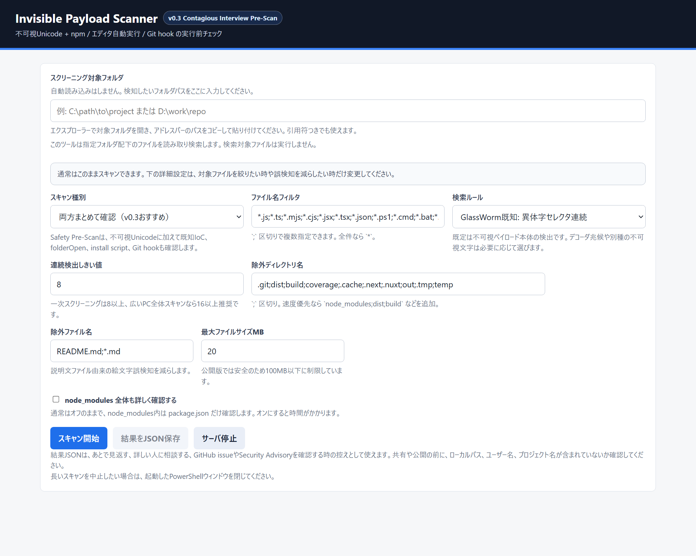

# Invisible Payload Scanner

自分用に作ったものですが、CLI操作に慣れていない方でも使えるように、Windows向けのローカルWeb UIにしました。

GitHubから落としたプロジェクトを、そのまま動かす前に確認するための一次スクリーニングツールです。外部サーバには送信せず、Windows上でローカルに動作します。

現在は、GlassWorm系で報告されている異体字セレクタと異体字セレクタ補助を主な対象にしています。検索ルールは変更できるので、今後ほかの不可視Unicode列にも拡張できます。

このツールは「感染判定器」ではなく、疑わしい不可視文字列を見つける検査補助ツールです。検出された場合は、ファイル種別、該当箇所、実行経路、入手元を確認してください。



英語版が必要な場合は [README.en.md](README.en.md) を参照してください。

## ダウンロードして使う

GitHubのReleasesから `InvisiblePayloadScanner-v0.1.0.zip` をダウンロードして展開してください。

展開したフォルダ内の `Start-InvisiblePayloadScanner.cmd` をダブルクリックすると、ローカルWeb UIが起動します。

このツールは外部サーバにスキャン内容を送信しません。指定したフォルダ配下のファイルをローカルで読み取り、不可視Unicode列を検索します。

## このツールの位置づけ

CIや開発者向けには、既存のCLI型スキャナも有用です。このツールは、それとは別に次の用途へ寄せています。

GlassWorm系の情報を追う中で既存の検知ツールはCLI型が多かったため、自分のWindows環境でフォルダを指定してすぐ確認できる、ローカル完結のWeb UIとして作りました。

- Windowsでダブルクリック起動できる
- 小さなブラウザUIからローカルだけでスキャンできる
- 大きなフォルダでも進捗が見える
- 不可視文字のコードポイントと周辺文字列を人間が読める形で表示する
- 今後の不可視文字系IoCに合わせて検索ルールを調整できる

フル機能のマルウェアスキャナ、パッケージ監査ツール、EDR、サプライチェーンセキュリティ製品を置き換えるものではありません。知らないプロジェクトを実行したり信頼したりする前に、疑わしい不可視ペイロードへ気づくための補助ツールです。

## 使い方

1. `Start-InvisiblePayloadScanner.cmd` をダブルクリックします。
2. ブラウザが開いたら、スクリーニング対象フォルダを入力します。
3. 必要ならファイル名フィルタ、除外ディレクトリ、除外ファイル、しきい値を調整します。
4. `スキャン開始` を押します。

検索対象ファイルは読み取るだけで、実行はしません。結果に表示される `[VS U+FE0F]` や `[VS U+E0100]` が不可視文字を可視化したものです。

フォルダパスは、エクスプローラーで対象フォルダを開き、アドレスバーの文字列をコピーして貼り付けるのが簡単です。Windowsの「パスのコピー」で `"C:\path\to\project"` のように引用符が付いても、そのまま貼り付けられます。

長いスキャンを途中で止めたい場合は、起動したPowerShellウィンドウを閉じてください。

## 既定のGlassWorm系検出式

```powershell
([\uFE00-\uFE0F]|\uDB40[\uDD00-\uDDEF]){8,}
```

- `U+FE00` から `U+FE0F` は `\uFE00-\uFE0F` で検索します。
- `U+E0100` から `U+E01EF` は .NET/PowerShell の正規表現上ではサロゲートペアとして `\uDB40[\uDD00-\uDDEF]` で検索します。
- `{8,}` は「8個以上の連続」を意味します。
- 一次スクリーニングは `8` 以上、広いPC全体スキャンなら `16` 以上を推奨します。
- 数字を小さくすると感度が上がり、数字を大きくすると誤検知が減ります。

このツールが内部で使う検索式を、PowerShellだけで最小確認する場合は次の形になります。

```powershell
Get-ChildItem -LiteralPath "C:\path\to\project" -Recurse -File -ErrorAction SilentlyContinue |
  Select-String -Pattern '([\uFE00-\uFE0F]|\uDB40[\uDD00-\uDDEF]){8,}'
```

`-Filter ""` は空ではなく、指定しないか `-Filter *` にします。`-Filter` は基本的に1つのワイルドカード指定なので、複数拡張子を扱う場合はこのツールのWeb UI側のように `;` 区切りの独自フィルタを使う方が扱いやすいです。

## 既定の除外

既定では、次のファイルを除外します。

```text
README.md;*.md
```

Markdown内の絵文字やアクセシビリティ記号では `U+FE0F` が普通に使われることがあり、`README.md` などの説明文ファイルは通常実行されないためです。

ただし、READMEやMarkdownをビルド工程でコード生成に使う特殊なプロジェクトを確認したい場合は、除外ファイル名から `README.md;*.md` を外して再スキャンしてください。

## 進捗表示

スキャンは2段階です。

1. 候補ファイルを数える
2. 候補ファイル内の不可視文字列を検索する

Web UIのゲージは、1段階目では動作中表示、2段階目では候補ファイル数に対する検索済み割合を表示します。巨大フォルダでは候補ファイルの列挙にも時間がかかります。

## 拡張性

Web UIの `検索ルール` で `カスタム正規表現` を選ぶと、今後別のIoCや不可視文字にも対応できます。

組み込みルールとして、次の補助検出も選べます。

- GlassWorm系の可視デコーダ兆候: `codePointAt()`、`0xFE00` / `0xE0100`、`eval()` / `Buffer.from()` などが近い範囲に現れるコード
- Trojan Source系の双方向制御文字
- JavaScript識別子として悪用されることがあるHangul filler
- ゼロ幅スペースなどのゼロ幅制御文字

例:

```powershell
[\u200B-\u200F\u2060-\u2064\uFEFF]{1,}
```

これはゼロ幅スペース、方向制御、BOMなどの不可視制御文字を探すための例です。

## 精度と安全性の設計

このツールの検出精度は、次の構造で高めています。

- 既知情報に合わせ、異体字セレクタ `U+FE00` から `U+FE0F` と異体字セレクタ補助 `U+E0100` から `U+E01EF` を対象にします。
- PowerShell/.NETの正規表現で5桁コードポイントを誤指定しないよう、補助面は `\uDB40[\uDD00-\uDDEF]` のサロゲートペアで検索します。
- 連続個数をしきい値化し、単発の絵文字用 `U+FE0F` と長い不可視ペイロードを分けやすくしています。
- 最新の公開分析で重視されている「不可視文字列本体」と「それを復元する可視デコーダ兆候」は別ルールとして確認できます。
- 検出箇所は不可視文字を `[VS U+XXXX]` として可視化し、周辺文字列、行、列、コードポイントを表示します。
- バイナリ拡張子、巨大ファイル、指定除外ディレクトリ、指定除外ファイルをスキップできます。

Web UI自体の安全性は、次の構造で高めています。

- 外部サーバにデータを送信しません。
- `127.0.0.1` のローカルHTTPサーバとして動作します。
- 起動ごとにランダムなローカルAPIトークンを生成し、スキャンや停止APIに必要とします。
- APIリクエストのOriginを確認し、別サイトからの単純なローカルAPI呼び出しを通しにくくしています。
- 指定されたファイルは読み取りのみで、実行しません。
- 検出結果はブラウザ上に表示され、JSON保存はユーザー操作時のみ行います。
- 検索に使う正規表現はPowerShell/.NET上で実行し、各ファイルごとに正規表現タイムアウトを設定しています。
- シンボリックリンクやジャンクションなどの再解析ポイントは追跡しません。
- リクエストサイズ、正規表現長、対象ファイルサイズ、候補ファイル数に上限を設けています。

この設計でも、次のものは保証できません。

- バイナリに埋め込まれたマルウェア
- インストール時に外部から取得されるコード
- 難読化された通常文字ベースのローダー
- Solana、Google Calendar、WebRTC、HTTPエンドポイントなどのC2痕跡の網羅検知
- `.npmrc`、GitHub token、SSH鍵、ウォレットなどのcredential harvesting挙動の網羅検知
- 既知の悪性パッケージ名、拡張機能名、IP、ウォレットアドレスなどのIoC照合
- 依存パッケージ自体の正当性
- 検出文字列が本当に実行経路に乗るかどうか

## プライバシー

このスキャナはローカル実行を前提にしています。

- `127.0.0.1` にだけバインドします。
- スキャン対象ファイルの内容を外部へアップロードしません。
- 外部APIを呼び出しません。
- パッケージインストールやネットワーク接続を必要としません。
- JSONエクスポートは、ユーザーが保存ボタンを押した場合だけ作成します。

スクリーンショットを公開する場合は、ローカルパス、ユーザー名、公開したくないパッケージ名やプロジェクト名が写っていないことを確認してください。

## 検出後の対応

まず、検出されたファイルの種類で優先度を分けます。

高優先度:

- `.js`, `.ts`, `.mjs`, `.cjs`, `.jsx`, `.tsx`
- `.ps1`, `.cmd`, `.bat`, `.sh`
- `package.json`, npm scripts, GitHub Actions, CI設定
- ビルド時や起動時に読まれる設定ファイル

低優先度または誤検知寄り:

- `README.md`
- `CHANGELOG.md`
- `docs/` 配下のMarkdown
- 絵文字、アクセシビリティ記号、バッジ、リンク周辺の `U+FE0F`
- `U+FE0F` が数個だけ連続している説明文

検出したら、次の順で確認します。

1. しきい値を `16` に上げて再スキャンします。
2. `README.md;*.md` を除外した状態で実行ファイル系だけ再スキャンします。
3. 実行されるファイルで長い不可視文字列が出た場合は、そのパッケージやリポジトリを使う作業を一旦止めます。
4. `npm install` やビルドをまだ実行していない場合は、実行しないまま入手元を確認します。
5. 既に実行済みの場合は、該当プロジェクトの依存関係、インストール時スクリプト、最近のコミット差分を確認します。
6. GitHubやnpmなどの公式ページ、issue、セキュリティアドバイザリで同名パッケージの報告がないか確認します。
7. 不審な場合はプロジェクトフォルダを削除する前に、検出結果JSON、該当ファイル、パッケージ名、バージョンを控えます。

誤検知の可能性が高い例:

```text
node_modules\focus-trap\README.md
U+FE0F U+FE0F U+FE0F U+FE0F
周辺表示: Accessibility や絵文字リンク
```

これはREADME内の絵文字・アクセシビリティ記号に反応している可能性が高く、感染確定ではありません。実行される `.js` や `.ts` に長い不可視文字列が出る場合とは扱いを分けてください。
